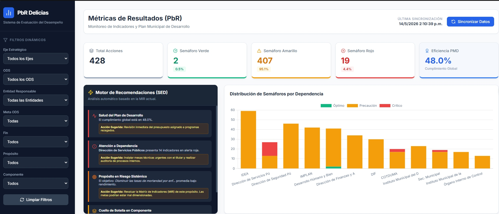
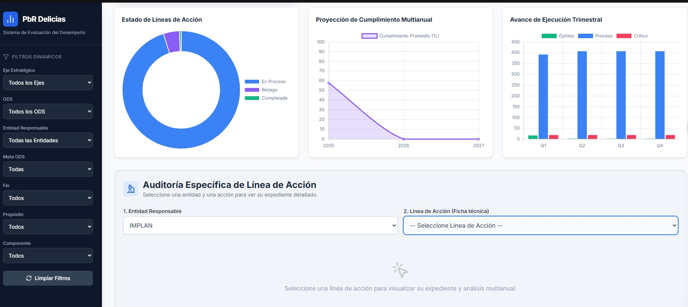
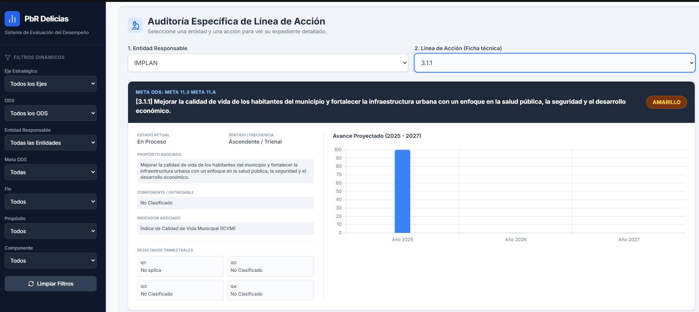

# PbR Delicias Dashboard

Dashboard estático para monitoreo de indicadores, semáforos de desempeño y auditoría de líneas de acción del municipio de Delicias. El proyecto está preparado para publicarse en GitHub Pages usando un único `index.html` y consume datos desde un CSV publicado de Google Sheets.

## Características

- KPIs generales de desempeño: total de acciones, semáforos y eficiencia PMD.
- Filtros dinámicos por eje, ODS, entidad, meta ODS, fin, propósito y componente.
- Visualizaciones con Chart.js para distribución por dependencia, estado, proyección anual y avance trimestral.
- Módulo de auditoría específica por línea de acción con expediente resumido y gráfica individual.
- Motor de recomendaciones con hallazgos automáticos a partir de los datos filtrados.
- Estructura lista para GitHub Pages sin proceso de build.

## Estructura

```text
.
├── index.html
├── README.md
└── assets/
    └── capturas/
        ├── image-2.jpg
        ├── image-3.jpg
        └── image-4.jpg
```

## Publicación en GitHub Pages

1. Crea un repositorio nuevo en GitHub.
2. Sube `index.html` al directorio raíz del repositorio.
3. Crea la carpeta `assets/capturas/` y coloca allí las imágenes de este README.
4. En **Settings > Pages**, selecciona la rama principal y la carpeta `/root`.
5. Guarda y espera a que GitHub publique el sitio.

## Dependencias externas

Este dashboard usa CDN para las librerías, por lo que requiere conexión a internet:

- Tailwind CSS
- Lucide Icons
- Chart.js
- PapaParse
- Google Fonts (Inter)

## Fuente de datos

La aplicación consume un CSV público de Google Sheets definido dentro de `APP_CONFIG.csvUrl` en `index.html`. Si cambias la hoja fuente, actualiza esa URL publicada.

## Personalización rápida

- Cambia el título del sitio en la etiqueta `<title>` y en el encabezado principal.
- Ajusta colores y sombras en el bloque `<style>`.
- Modifica los mapeos de columnas en `fieldMappings` si tu Google Sheet cambia de nombres.
- Si deseas usar un archivo local en vez de Google Sheets, reemplaza `APP_CONFIG.csvUrl` por la ruta de tu CSV.

## Capturas

### Vista general



### Módulo de gráficas y auditoría



### Auditoría específica de línea de acción



## Notas técnicas

- Arquitectura **single-page** en `index.html`, orientada a despliegue estático en GitHub Pages sin pipeline de build ni backend propio.
- La capa de datos se alimenta desde un CSV público de Google Sheets consumido con PapaParse mediante `download: true`, `header: true` y `skipEmptyLines: true`.
- El mapeo semántico de columnas se resuelve con el objeto `fieldMappings`, que permite tolerancia ante variaciones de encabezados, acentos, mayúsculas y nombres alternativos.
- La función `getValue()` aplica búsqueda por coincidencia estricta, coincidencia normalizada, coincidencia parcial segura y fallback por índice de columna para robustecer la extracción de campos críticos.
- El estado de avance se normaliza con `normalizeSemaforo()` hacia las categorías `Verde`, `Amarillo`, `Rojo` y `Gris`, lo que unifica criterios visuales y analíticos en todo el tablero.
- El cálculo de eficiencia global del PMD se basa en `calculateScorePMD()`, asignando ponderaciones 100, 50, 0 y 25 según el semáforo normalizado de cada línea de acción.
- La capa visual utiliza Tailwind CSS por CDN, componentes tipo `glass-card`, layout lateral fijo de filtros y un contenedor principal responsive optimizado para escritorio, tablet y móvil.
- La iconografía se renderiza con Lucide y se reinicializa dinámicamente tras inyecciones HTML, especialmente en el módulo de recomendaciones automáticas.
- Las visualizaciones usan Chart.js y cubren cinco componentes analíticos: distribución de semáforos por dependencia, estado de líneas de acción, proyección multianual, avance trimestral y expediente individual de auditoría.
- El panel de auditoría específica implementa un flujo de drill-down por entidad y línea de acción, mostrando metadatos, resultados trimestrales y una gráfica de cumplimiento 2025-2027 por registro seleccionado.
- El motor de recomendaciones genera hallazgos automáticos sobre salud global, dependencias críticas, mejores prácticas, propósitos en riesgo, cuellos de botella y tendencias trimestrales a partir del conjunto filtrado.
- La interacción del usuario se controla mediante listeners desacoplados para filtros, reinicio, sincronización y selectores de auditoría, evitando atributos inline y facilitando mantenimiento.
- La inicialización del tablero ocurre en `DOMContentLoaded`, donde se cargan iconos, eventos, estado vacío del drill-down y sincronización inicial de datos.
- La solución depende de conectividad externa hacia CDNs y hacia la hoja publicada de Google Sheets, por lo que la disponibilidad del dashboard está sujeta a esos servicios.

## Autor

Desarrollado por **Alonso Villalobos Lara**.
